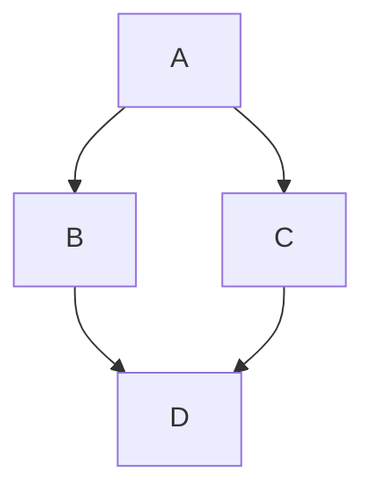

# ppnm
Repository til praktisk programmering og numeriske metoder

Her er mine øvelser og homeworks til dette kursus. Nedenfor er en test af githubs nye graf-ting.

```mermaid
    graph TD;
      A-->B;
      A-->C;
      B-->D;
      C-->D;
```
