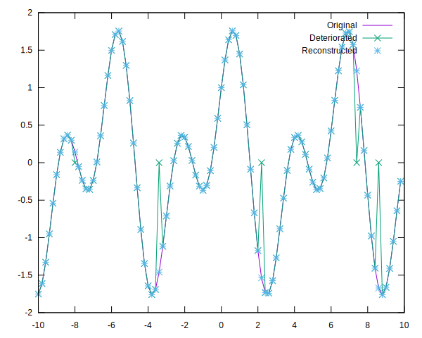
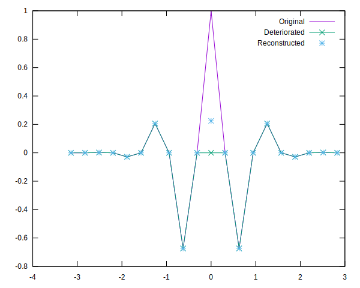
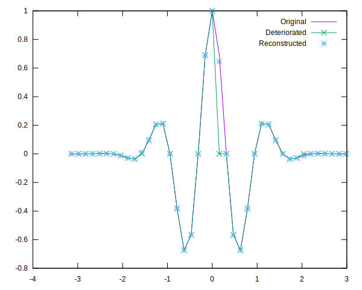
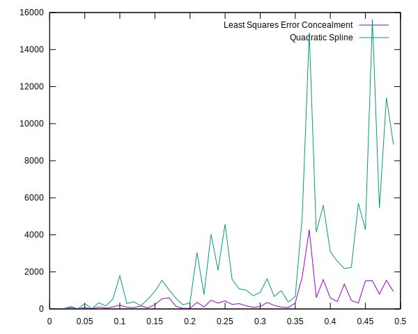
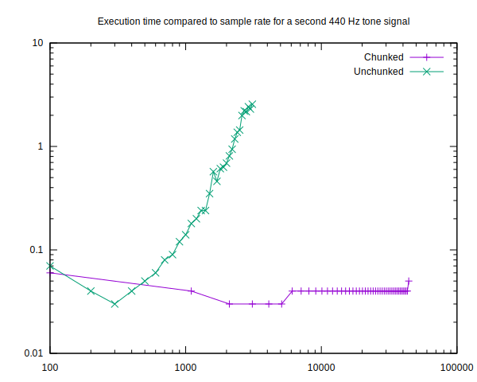

# Least Squares Error Concealment
This is my exam project. I would estimate the work here to be equivalent to a
part A) a part B) and a part C)

# A) Implement the least square error concealment algorithm
This happens in ls_error_conceal.cs, and some tests are done in lsec_test.cs.
These produce the plots in figure sinus1.svg, wavelet1.svg and wavelet2.svg.
They show that the technique works in general, but that for very quickly varying
points placed far apart the technique introduces some error.

# B) Testing error introduced by algorithm and comparison to error concealment using splines 
The error introduced made me curious how well another interpolation algorithm
(splines) would compare. I've tried to estimate the average squared difference
error introduced by the least squares and compared it to just papering over
the errors with quadratic splines. The results can be seen in comp_wavelet.svg.
Generally the average error is lower and as the error rate (chance to replace
signal with 0) increased to unreasonable levels, the least squares method is a
lot less prone to wild swings.

# C) Allow chunking the reconstruction to save time
The QRGS solver I'm using to solve the error concealment is O(n³) and that's
a problem when you want to use such error concealment for long sequences, such
as audio files. Which at a sample rate of 44100 points per second, make for
very long computation times. Luckily the system we're attempting to solve is
very sparse and the solution to a specific error point only depends on it and
some of it's nearest neighbors. Thus we can seperate the signal into contigous
chunks of either errored bits or good bits and solve the individual errored
chunks on their own. I've run some timings on these to verify that it is indeed
faster, and these measurements can be seen in split_time.txt. In addition
they are plotted in timed.svg and as can be seen the chunked implementation is
magnitudes faster. Apparently without any loss of reconstruction accuracy. The
4th column is the exit status of the reconstruction, with a 1 being a greater
than 5% divergence in the signal at some of the points (that is approx(y,
y_reconstructed, 5e-2, 5e-2)). The only erroring reconstructions are at 100
sample rate, and that's to be expected with a 440 hz signal.

