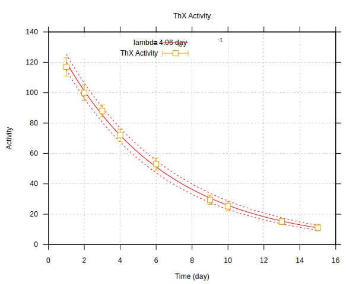

# Least squares fitting algorithms
Everything seems to work, main algorithms is contained in lsfit.cs. The Radium
224 fitting is done in halflife.cs.

# Radium fit
A gnuplot readable version of the fit is in ThX_lambda.fit. A calculation of the
halflife is in Out.txt. The fit and measurements are plotted in lambda_fit.svg.

# Accuracy of fit
Including the variance and tranforming the fitted lifetime to halflife, we get
a halflife of \lambda_{1/2} = 4.06\pm 0.17 day^{-1}. This is higher than the
modern measurement of radium 224 halflife, which wikipedia tells me is 3.6139
days, even when accounting for the calculated uncertainty.

# Error-shifted fits
These are also shown in lambda_fit.svg. 

