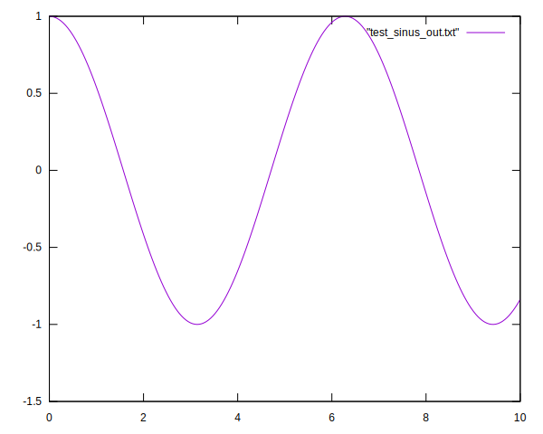
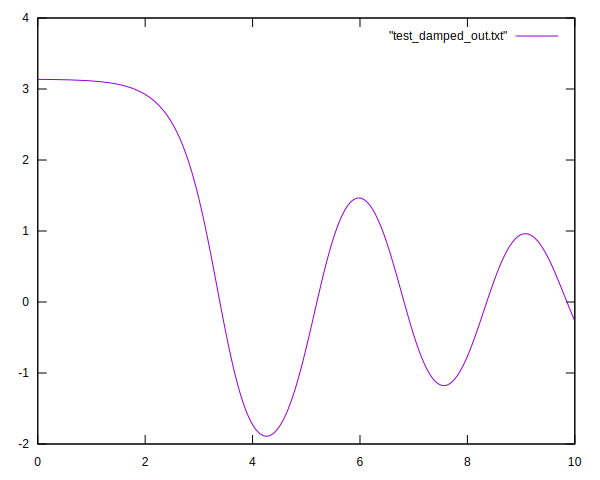
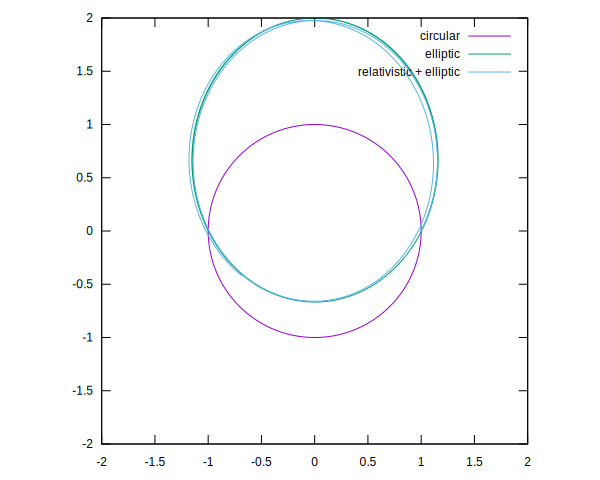
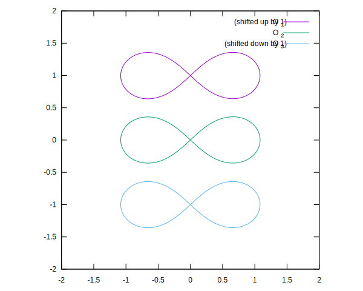

# Ordinary Differential Equations
Here's my solution to the ODE homeworks. The main runge-kutta driver can be found in rk.cs, together with a linear euler step driver i've used for debugging unstable problems. The figures test_sinus_graph.svg and test_damped_graph.svg are simple test cases for the Runge Kutta 12 method, and they behave as expected.

# Interpolant interface and relativistic orbit
The interpolant interface also works as expected. The relativistic equatorial motion is plotted in test_eq_graph.svg and shows the expected precession in the relativistic case.

# Stable three body motion
Can be seen in test_figure_eight_graph.svg. I've moved two of the bodies up and down in the y direction, otherwise the motion of one would obscure the motion of the other completely. 

