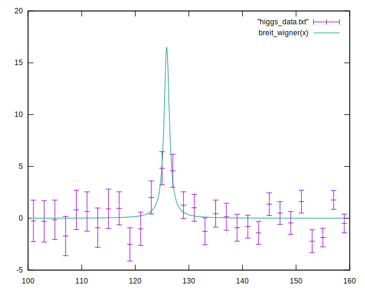
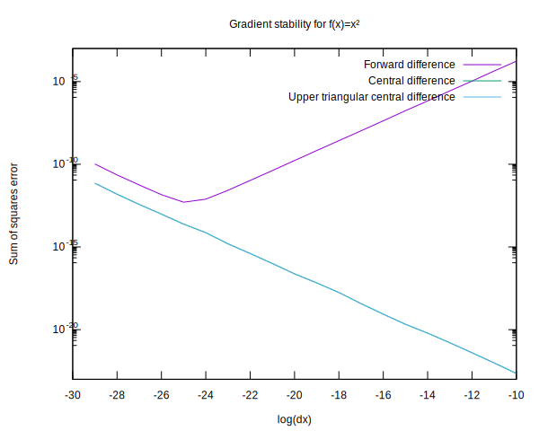
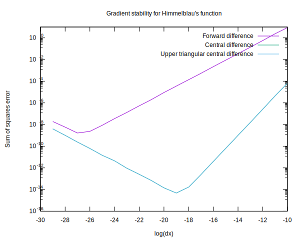
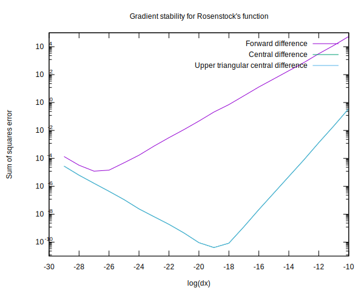
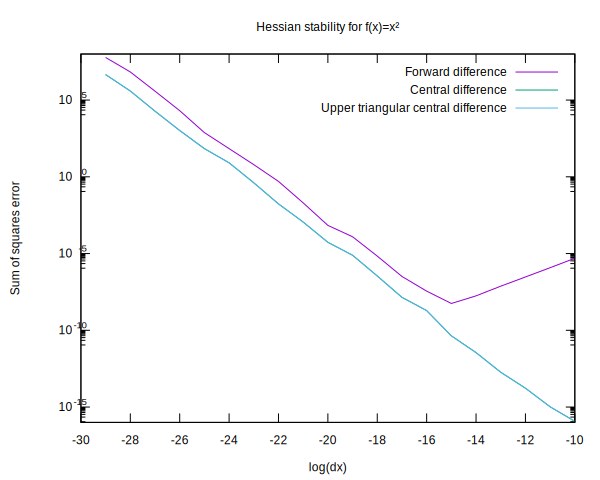
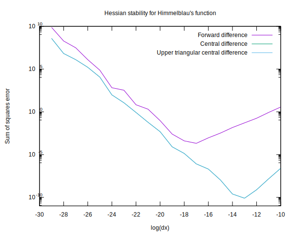
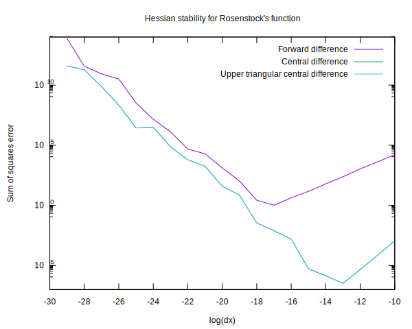

# Minimization
I'm not certain this implementation is bug-free, I've spent some time testing
especially the hessian implementation especially, and it seems to be numerically
unstable at the suggested Pow(2,-26) dx scale. These are detailed in the forward
vs central difference section.

Some general tests of the minimization can be seen in Out.txt, as can be when
sampling randomly in the test of the Rosenstock function, many of these points
don't converge properly to one of the minima. Inspecting the output of make, see
log.txt, the minimization function for many of these wrongly converged points
don't move from the starting point.

# Higgs boson fit
The fit can be seen in higgs_fit.txt and higgs_fit.svg. It's pretty sensitive to
initial guess but that's pretty common to function fitting in my experience.

# Forward vs Central difference
Some tests of the numerical hessian and gradient at different choices of
exponent can be seen in the grad_stability and hessian_stability images.
There's tests of both forward difference and central difference implementations.
As can be seen the central difference calculation is much less error prone.
There's seemingly no difference between calculating the whole hessian versus
only calculating the diagonal and upper triangle, in the central difference
algorithm.

